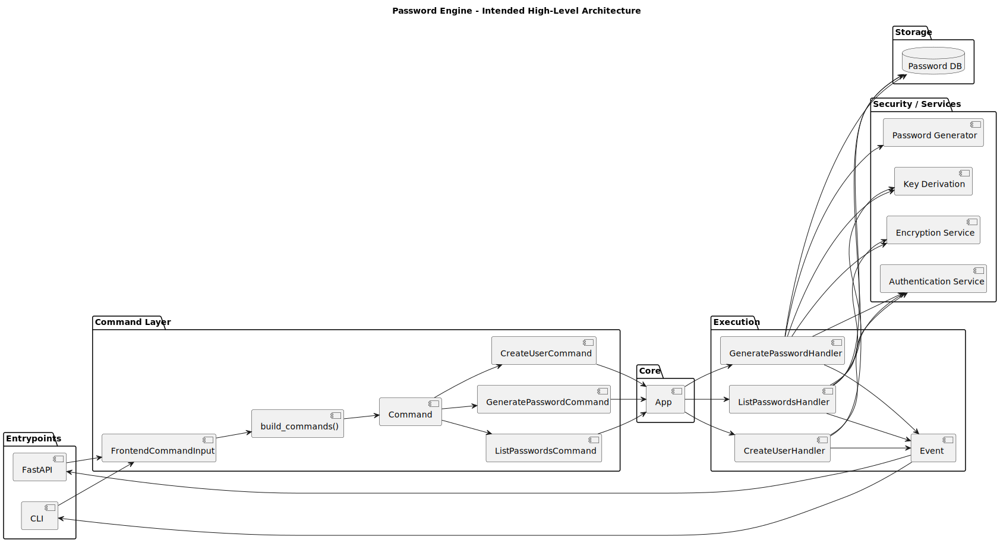

# Architecture

## Overview

The application is built around a **command-driven architecture** tailored for secure password management.

It separates:
- input (CLI / API)
- execution (App + Handlers)
- security (authentication + encryption)
- output (Events)

---

## Components

### Frontends
- CLI
- FastAPI

These are thin layers responsible only for:
- parsing input
- prompting user (CLI)
- presenting output

---

### Command Layer

- `FrontendCommandInput`
- `build_commands()`
- `Command`

This layer converts external input into structured commands.

Examples:
- `CreateUserCommand`
- `ListPasswordsCommand`
- `GeneratePasswordCommand`

---

### Core (`App`)

The `App` acts as the orchestrator:

- receives commands
- resolves handlers
- executes logic
- yields events

The core does **not**:
- know about CLI input
- know about HTTP
- handle encryption directly

---

### Handlers

Each command has a corresponding handler:

- encapsulates domain logic
- interacts with storage layer
- emits events

Examples:
- `CreateUserHandler`
- `ListPasswordsHandler`
- `GeneratePasswordHandler`

Responsibilities:
- authentication (via provided credentials)
- key derivation (from user password)
- encryption/decryption of stored data

---

### Security Layer (Conceptual)

Handled inside handlers / services:

- Password hashing (for authentication)
- Key derivation (unlock encryption key)
- Encryption/decryption (database contents)

This ensures:
- no plaintext secrets stored
- database is unusable without credentials

---

### Storage Layer

- Database (Postgres or similar)
- Stores:
  - users
  - hashed credentials
  - encrypted passwords
  - metadata (email, tag, owner)

---

### Events

Events are the output abstraction:

- `EvtLog`
- `EvtProgress`
- `EvtResult`
- `EvtError`

Examples:
- "User created"
- "Passwords retrieved"
- "Generated password"
- "Authentication failed"

Frontends decide how to display them.

---

## Design Principles

- Separation of concerns
- Security-first design (no plaintext secrets)
- Extensibility (add commands without touching core)
- Frontend independence (CLI/API reuse same backend)
- Stream-based execution (generator pattern)
