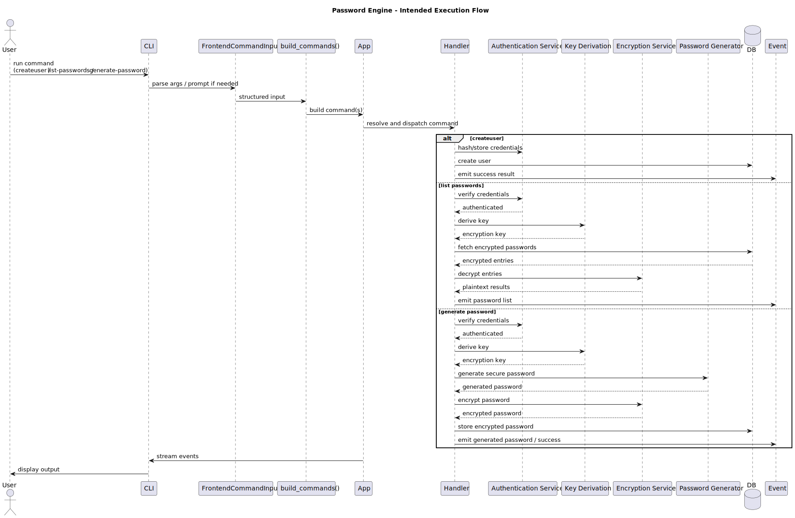

# Execution Flow



## Step-by-step

### 1. User triggers a command

CLI examples:

```bash
password-engine createuser --username=noorac --password=secret
password-engine --list-passwords
password-engine --generate-password
